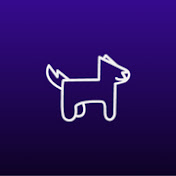

<h2>dogcode</h2>
<h3>Testes no React com Vitest, Testing Library e Jest</h3>

Um dos requisitos mais exigidos pelas empresas é testes. Garantir que tudo está funcionando e mais do que isso, garantir que mesmo que após uma refatoração tudo continue como estava antes é muito importante para o futuro de uma aplicação.

<h3>Tempo Estudando o projeto</h3>

  

<h4><b>Status do projeto:</b> :speech_balloon: Estudando</h4>
